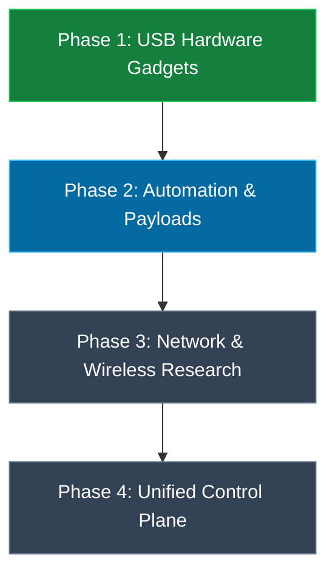

# Hard-Tools Strategic Roadmap & Execution Plans

This document outlines the current project status, verified modules, and planned phases for future development.

---

## 1. Project Phase Breakdown

---

## 2. Phase 1: USB Hardware Gadget Infrastructure (COMPLETED)

- [x] **Consolidated HID Controller (`scripts/usb-gadget.sh`)**:
  - Dynamic discovery of `/dev/hidg*` nodes.
  - Full 104-key USB Keyboard injection with configurable microsecond delays.
  - 12-byte Precision Touchpad support (Report ID `0x01` relative pointer + Report ID `0x04` digitizer).
  - Mouse buttons (left, right, middle, double-click, drag).
  - Background anti-sleep mouse jiggler with PID tracking.
  - Integrated DuckyScript subset parser.
- [x] **Mass Storage Manager (`mass_storage_manager.sh`)**:
  - Working FAT32/exFAT disk image emulator.
- [x] **RNDIS USB Ethernet (`scripts/rndis.sh`)**:
  - High-speed USB network adapter + `dnsmasq` DHCP server (`192.168.42.x`).
  - Layer 2 ARP and NAT routing.
- [x] **UVC USB Webcam (`scripts/uvc_webcam.sh`)**:
  - Kernel `/dev/video2` video sink instantiation & test stream support.
- [x] **Composite Gadget Manager (`scripts/composite_gadget.sh`)**:
  - Simultaneous multi-function presets:
    - Preset 1: HID + Mass Storage
    - Preset 2: HID + RNDIS Ethernet
    - Preset 3: HID + Mass Storage + RNDIS
    - Preset 4: Full Arsenal (HID + Storage + RNDIS + UVC Camera)
- [x] **Master TUI Dashboard (`launcher.sh`)**:
  - Central ANSI menu with live module status indicators.

---

## 3. Phase 2: Cross-Platform Payload Library (CURRENT)

- [ ] **Windows Automation Payloads (`payloads/windows/`)**:
  - PowerShell system diagnostic collectors.
  - Network interface & route dumper.
  - Test hotkey sequences (`Win+R`, `Ctrl+Shift+Esc`).
- [ ] **Linux Automation Payloads (`payloads/linux/`)**:
  - Terminal launcher (`Ctrl+Alt+T`) and diagnostic collector (`uname`, `ip a`, `lsblk`).
- [ ] **macOS Automation Payloads (`payloads/macos/`)**:
  - Spotlight launcher (`Cmd+Space`) and `system_profiler` diagnostic.

---

## 4. Phase 3: Wireless Research & Subsystem Diagnostics (PLANNED)

- [ ] **External USB OTG Wi-Fi Stack**:
  - Support for USB Wi-Fi dongles with in-tree `mac80211` drivers (Atheros `ath9k_htc`, MediaTek `mt7601u`, Ralink `rt2800usb`).
- [ ] **Bluetooth Recon & Diagnostics (`scripts/bt_arsenal.sh`)**:
  - BlueZ device inquiry, BLE discovery, L2CAP ping latency testing.

---

## 5. Phase 4: Local Web Control Plane (PLANNED)

- [ ] **Mobile Web TUI / Control Dashboard**:
  - Lightweight Python web UI listening on `192.168.42.1:8080` (or `localhost:8080`) allowing point-and-click gadget management from the phone's local browser or connected host.
